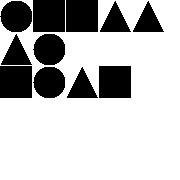
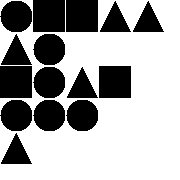

## Shaper - a crude DSL for basic image creation

`Shaper` is a DSL that can be used to produce images containing simple shapes.

The provided compiler produces square shaped images. An image contains several rows of different shapes (triangles, circles, squares).
The resulting image looks like a table of shapes.



### The Language

The `Shaper` language is very basic and does not have safeguards. It should be used as it is intended.

* The source code must be a _one-linear_ that begins with a positive integer denoting the resolution of the output image (Eg: `512`)
* The image description starts after the begin sequence `>>>`
* Individual rows are separated by pipe `|`. There is no pipe after `>>>` or in front of `<<<`.
* Individual shapes are separated by coma `,`. A row must not begin with a coma or end with a coma.
* The row is then made up of a list of shapes(`square`, `circle`, `triangle`). 
* The code finishes with the end sequence `<<<`

### How to use it

### Maven

TBA

### CLI

TBA

### Compiler

Clone the repo and run `./gradelw shadowJar`. You'll find the uber-jar in `./build/libs/shaper-all.jar`.
Generate a file like this: `java -cp shaper-all.jar com.cosminsanda.shaper.compiler.Shaper2Image --source-code "180>>>circle,square|triangle<<<" --out-filename test.png
`

### Example code

`test002.shape` file content:

```180>>>circle,square,square,triangle,triangle|triangle,circle|square,circle,triangle,square|circle,circle,circle|triangle<<<```

Sample `Kotlin` code that useses the external `test002.shape` file to produce a `.png` file:

```kotlin
val code = FileInputStream(File("test001.shape"))
val res = Shaper2Image().compile(code)
val img = ImageIO.read(ByteArrayInputStream(res))
val outputfile = File("myshape.png")
ImageIO.write(img, "png", outputfile)
```
Sample output:

